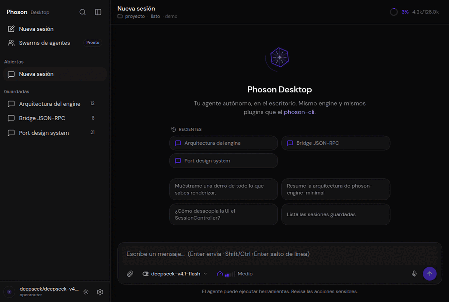

<p align="center">
  
</p>

<h1 align="center">Phoson Desktop</h1>

<p align="center">
  <strong>Desktop app (Tauri 2 + React) for the Phoson autonomous-agent platform</strong>
</p>

<p align="center">
  <a href="https://tauri.app"></a>
  <a href="https://react.dev"></a>
  <a href="https://www.typescriptlang.org"></a>
  <a href="https://www.python.org"></a>
</p>

Phoson Desktop is the graphical front end for
[`phoson-engine-minimal`](https://github.com/phoson-lat/phoson-engine-minimal).
It reuses the engine's **runtime, plugins and session model** unchanged — the
core has no UI dependency, so the desktop app is a new *sink*, not a fork.

<p align="center">
  
</p>

## Architecture

```
┌───────────────────────────────────────────────┐
│  Webview (React 19 + Vite + Tailwind v4)       │
│    stores (zustand) · features · bridge client │
└───────────────▲───────────────┬───────────────┘
                │ invoke / listen│
┌───────────────┴───────────────▼───────────────┐
│  Tauri 2 shell (Rust) — pure transport          │
│    one sidecar process per workspace            │
└───────────────▲───────────────┬───────────────┘
                │ JSON-RPC       │ notifications
                │ (NDJSON/stdio) │
┌───────────────┴───────────────▼───────────────┐
│  Sidecar (Python) — phoson_bridge               │
│    SessionManager: 1 PhosonRepl per session     │
└───────────────▲───────────────┬───────────────┘
                │                 │
        phoson-engine-minimal (AgentEngine, plugins, tools, storage)
```

- **Transport is domain-agnostic.** Rust only frames NDJSON, matches JSON-RPC
  responses by `id`, and re-emits notifications to the webview.
- **One sidecar per workspace.** Each project gets its own process, so tools
  resolve relative paths against *its* working directory and several projects
  run side by side without clobbering each other.
- **Many sessions per sidecar.** Each session owns its `PhosonRepl`
  (`SessionController` + sink + confirmation service).

## Features

- **Multiple projects & sessions at once** — per-workspace sidecars, per-session
  state, a unified (global) history list, and session routing by workspace.
- **Faithful streaming** — text and tool calls are rendered in the real order the
  ReAct loop emits them; a collapsible **reasoning** block (“Thinking…”) with
  live duration.
- **Rich rendering** — GitHub-flavoured Markdown, LaTeX (KaTeX), Mermaid
  diagrams and **sandboxed** HTML artifacts; syntax highlighting via **Shiki**
  with languages/themes loaded on demand.
- **Tools** — expandable tool rows; `view_image` results are **previewed inline**
  (and can be opened in the system viewer).
- **Attachments** — images travel as native engine attachments; **any other
  file** (PDF, video, audio, archives, code…) is uploaded to
  `<workspace>/uploads/` and referenced in the prompt so the agent reads it with
  its own tools.
- **Voice dictation** — Web Speech API when available (Chromium/WebView2), or the
  engine's offline STT plugin (Moonshine) on WebKitGTK/WKWebView, via the sidecar.
- **Command palette** (`Ctrl/⌘+K`) — new session, undo turn, compact context,
  copy/export conversation, change theme, restart the project engine, and search
  sessions. **Reasoning effort** quick picker on `Ctrl/⌘+E`.
- **Sub-agent progress** panel, context-window meter, model/provider pickers, MCP
  settings, first-run onboarding.
- **Agent swarms** — define a team as a tree (a **master** plus specialised roles,
  each with its own purpose, tool allowlist, model and token budget) and launch it:
  the master creates the swarm through the engine's own `swarm_*` tools and
  delegates. A **Messages** panel reconstructs the inter-agent traffic, with
  `swarm_message` rendered as `@sender → @recipient` and `@` mentions highlighted.
  Note the engine semantics: members are handed no messaging tools, so the master
  is the only router and a message is delivered to the recipient's inbox on its
  **next run** — it is routing, not live chat. The tree is **live**: each node
  reflects its role's state (idle / assigned / messaged / running / error) derived
  from the session's `swarm_*` tool calls, and an **Executions** tab keeps the
  history of every launch (mission, time and the conversation it ran in). The
  **Messages** panel also hosts a composer so you can write to the team: `@role`
  routes the message to those members (the master is asked to pause them and
  deliver it), while a message with no mention goes to the master/orchestrator.
  The tree is drawn as an **editable graph** where each connection means
  **bidirectional communication**: drag between a role's handles to connect or
  disconnect it, and add roles with the floating **+** button (a modal). That
  graph is **design-only** for now — the engine still routes through the master —
  see `ENGINE_GAPS.md` (G1/G2).
- **Updates** — Tauri updater with a signed static feed.

## Requirements

- **Node.js** ≥ 20 and **pnpm**
- **Rust** toolchain + the usual [Tauri v2 prerequisites](https://tauri.app/start/prerequisites/)
  (WebView2 on Windows, WebKitGTK on Linux, WKWebView on macOS)
- **Python 3.12** with `phoson-engine-minimal` installed in a virtualenv

The sidecar looks for the engine next to this repo by default; override it with
`PHOSON_ENGINE_DIR`:

```bash
export PHOSON_ENGINE_DIR=/path/to/phoson-engine-minimal   # expects .venv/bin/python
```

## Quick start

```bash
pnpm install

# UI only, no backend (mock bridge) — handy for design work
pnpm dev

# Full desktop app (spawns the Python sidecar from the engine venv)
pnpm tauri dev
```

If the engine venv is elsewhere, set `PHOSON_ENGINE_DIR` before `pnpm tauri dev`.

## Packaging & distribution

```bash
scripts/build-sidecar.sh    # PyInstaller bundle of the sidecar (per-platform)
pnpm tauri build --config src-tauri/tauri.release.conf.json
```

The bundled sidecar ships the engine plugins `bgjobs`, `monitor`, `checkpoint`,
`mcp`, `stt` and `swarm`. Code signing and the update feed are documented in
[`DISTRIBUTION.md`](DISTRIBUTION.md).

## Keyboard shortcuts

| Shortcut | Action |
|---|---|
| `Ctrl/⌘ + K` | Command palette (actions + session search) |
| `Ctrl/⌘ + E` | Reasoning effort picker |
| `Enter` | Send message |
| `Shift/Ctrl/⌘ + Enter` | New line (continues Markdown lists) |
| `Esc` | Stop generation / close the focused overlay |

## Project layout

```
src/            React app: stores, features, components, bridge client
src-tauri/      Rust shell: JSON-RPC transport, native commands, bundle config
bridge/         Python sidecar (phoson_bridge) + PyInstaller spec
scripts/        Tooling (sidecar build, icon generation)
```

## Documentation

- [`PLAN.md`](PLAN.md) — architecture plan and integration points
- [`PROTOTYPE.md`](PROTOTYPE.md) — prototype notes
- [`DISTRIBUTION.md`](DISTRIBUTION.md) — packaging, signing and updates
- [`RELEASE.md`](RELEASE.md) — alpha release checklist + QA
- [`PERF.md`](PERF.md) — performance method, baseline and budgets
- [`ENGINE_GAPS.md`](ENGINE_GAPS.md) — features needed from the engine team
- [`CONTRIBUTING.md`](CONTRIBUTING.md) — dev setup and PR checks
- [`SECURITY.md`](SECURITY.md) — how to report vulnerabilities

## License

MIT — see [`LICENSE`](LICENSE).
